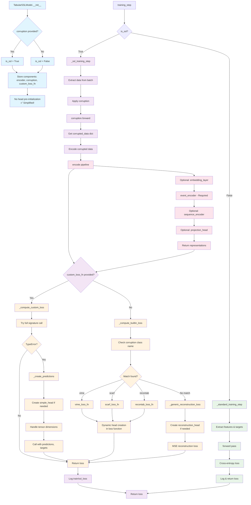

# TabularSSLModel Logical Flow Diagram

## 🔄 Complete Model Flow

## 🎯 Key Simplifications Highlighted

### ✅ Removed Complexity
- **No head pre-initialization** in constructor
- **Dynamic head creation** only when needed in loss functions
- **Unified interface** for any loss function
- **Clean auto-detection** with dictionary mapping

### 🔄 Streamlined Flows

#### 1. **Initialization Flow (Top)**
- Simple component storage
- SSL mode detection based on corruption presence
- No complex head initialization logic

#### 2. **Training Dispatch (Middle Left)**
- Clean branch between SSL and standard training
- Single entry point with clear routing

#### 3. **SSL Training Flow (Center)**
- Linear flow: data → corruption → encoding → loss
- Clear separation of custom vs built-in loss paths

#### 4. **Loss Computation (Right Side)**
- **Custom path**: Try full signature, fallback to simple
- **Built-in path**: Auto-detect corruption type, use appropriate loss
- **Fallback**: Generic reconstruction for unknown types

#### 5. **Encoding Pipeline (Bottom)**
- Clear sequence of optional and required components
- Consistent interface throughout

## 📊 Flow Characteristics

### 🟢 **Green (Standard Training)**: Simple supervised learning path
### 🟣 **Purple (SSL Training)**: Self-supervised learning orchestration  
### 🟠 **Orange (Loss Computation)**: Flexible loss function handling
### 🟥 **Pink (Encoding)**: Representation learning pipeline
### 🔵 **Blue (Initialization)**: Setup and configuration

## 🚀 Benefits of This Design

1. **Clear Separation**: Each flow has distinct responsibilities
2. **Unified Interface**: Single entry point handles any loss function
3. **Dynamic Adaptation**: Components created when needed with correct dimensions
4. **Extensible**: Easy to add new corruption types or loss functions
5. **Maintainable**: Clear boundaries make debugging and testing easier

The diagram shows how the simplified TabularSSLModel achieves **maximum flexibility with minimum complexity**! 🎉 